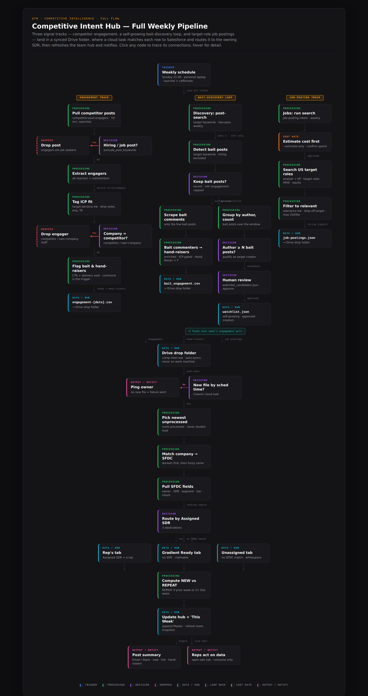

# Competitive Intent Hub

**A weekly pipeline that turns noisy public signals into a deduped, ICP-filtered, CRM-routed worklist — one tab per rep, fully unattended.**

**Problem.** The team's existing intent tooling surfaced hiring and engagement signals weeks late. By the time a relevant job posting or a competitor-post engager showed up, the window to reach out had usually closed — and there was almost no visibility into the accounts running engagement-bait posts to farm that attention in the first place.

**Action.** This pipeline pulls those signals straight from LinkedIn every week, normalizes and dedupes them into one schema, tags what's new, and hands each row to the sales rep who owns the account. A self-growing watchlist tracks the engagement-bait posters the old tool never showed, and the final match-and-route runs automatically on a CRM-connected account.

**Result.** Reps open a fresh, deduped, per-rep worklist each week instead of stale rows weeks after the fact, with this week's hand-raisers flagged the moment they surface.

## Pipeline at a glance

<p align="center">
  <a href="diagrams/pipeline-flow.html">
    
  </a>
</p>

Color-coded by role — trigger, processing, decision, dropped, data/hub, loop-back, cost gate, output/notify. Open [`diagrams/pipeline-flow.html`](diagrams/pipeline-flow.html) in a browser for the interactive version: hover any node for detail, click any node to trace its connections.

## The three signal tracks

| Track | What it captures | How |
|---|---|---|
| **Engagement** | People reacting to / commenting on competitor and category content — warm attention | Scrape competitor company pages, target execs, and an approved creator watchlist; keep reactors + commenters who fit the ICP |
| **Bait-discovery loop** | *New* creators worth watching, and immediate hand-raisers | Search for engagement-bait posts, then read comments only on those; surface commenters now, promote prolific authors to the watchlist |
| **Job postings** | Companies hiring for the problem — budget + intent | Search target roles; filter to genuinely relevant titles |

## Architecture: three roles

| Role | Runs where | Does |
|---|---|---|
| **Scrape** | Local runner | The three scrapes → raw CSV/JSON into a synced `comp-intel-raw` folder |
| **Ingest** | Automation account | Consolidate → dedupe → normalize → tag NEW/REPEAT → append a dated batch to the `Master` tab |
| **Match & route** | CRM-connected account | Match company → CRM, fill the handoff columns, regenerate per-rep tabs, post the summary |

The ingest engine leaves the last three columns blank — that blank gap *is* the handoff seam — so the CRM match/route runs as a separate automated job on the CRM-connected account. **This repo is the scrape + ingest half.**

## How a week runs

1. **Trigger.** A `launchd` agent fires Sunday 21:00 (a `pmset` wake at 20:55 covers a sleeping machine; `caffeinate` holds it awake through the run). An idempotency marker means a second fire in the same ISO week is a no-op.
2. **Engagement track.** Pull recent competitor/exec/watchlist posts → drop hiring posts → extract every reactor/commenter → enrich title + company → ICP-gate → flag hand-raisers → `engagement-{date}.csv`.
3. **Bait-discovery loop (two-pass, cost-optimized).** Pass 1 searches post *text* for engagement-bait (a CTA paired with a promised deliverable; hiring excluded) — cheap, no comment scraping. Pass 2 reads comments only on those few bait posts: commenters become **hand-raisers surfaced this week**, while prolific bait authors flow into a candidate list behind a **human-review gate** before joining the self-growing watchlist that feeds next week's engagement pull.
4. **Job-posting track.** A cost-estimate gate confirms spend, then search target roles → filter to relevant titles → `job-postings-{date}.json`.
5. **Converge + ingest.** All three land in the synced Drive folder. The ingest consolidates them into the 18-column schema, collapses duplicate posts, tags NEW vs REPEAT against history, and appends the batch to `Master`.
6. **Match & route (automated, separate CRM account).** Match each row to the CRM (domain first, then fuzzy name; 0.75–0.90 matches flagged for human review), fill `SFDC Account / Assigned SDR / Segment-Tier`, route into the rep's tab / a claimable pool / unassigned whitespace, refresh the team snapshot, and post a summary.

## Key design decisions

The design choices that make it cheap and trustworthy enough to leave running every week:

**Deterministic core so it can run unattended.** The scrape→ingest→upload path is plain Python with no LLM in the loop, so a `launchd` timer can own it. (An LLM is used only as a *fallback* to label a post topic the keyword map missed — never on the critical path.)

**Cost discipline, because the scraper is pay-per-event.**
- *Two-pass bait discovery*: search post text first (cheap), scrape comments only on the handful of posts that are actually bait — instead of scraping every comment everywhere.
- *Estimate-cost gate* before the jobs run; per-query caps; a trimmed term list.
- *Idempotency marker* per ISO week: an accidental second run skips before spending a cent.

**Data quality the reps will actually trust.**
- *Twin-URL dedup*: LinkedIn surfaces the same post under `ugcPost` and `activity` URLs — these are collapsed to one row (keep `activity`), plus exact-dupe removal.
- *NEW vs REPEAT*: a row is REPEAT if the person/company appeared in a prior week, or engaged with ≥2 posts this batch — so reps see momentum, not noise.
- *Positive ICP gate where a tier match wins over an exclude word*: a CPO whose headline happens to contain "developer" is kept, not dropped. The gate requires a real Tier-1/2 signal rather than just an absence of bad words.

**Precision over automation where a wrong call is expensive.**
- *Newly-discovered creators go behind a human-review gate* — candidates never auto-join the watchlist; you approve the real ones.
- *CRM matching is domain-first; fuzzy name matches in the 0.75–0.90 band go to human review, not auto-route* — a mis-route sends a lead to the wrong rep.
- *Hand-raisers are surfaced immediately*, not held behind an engagement threshold — buying intent is time-sensitive.

**Built to be forked.** The ICP persona classifier is overridable via an optional `icp` block in `config/targets.json` (regex tiers + topic themes), so retargeting to a different market is a config change. See [`docs/ADAPTING.md`](docs/ADAPTING.md).

**Schema robustness.** The append verifies the live sheet's first 15 column headers exactly but stays deliberately tolerant of the three trailing handoff labels — so a cosmetic difference there (the canonical sheet uses `SFDC Account` / `Assigned SDR`) never blocks a write, while a real column misalignment still does.

**Privacy as a hard rule.** `data/` is gitignored and nothing scraped is ever committed; real targets and the watchlist live in gitignored files with committed `.example` templates. The repo is the *engine*, not the *data*.

## The unified schema

One row per signal, 18 columns shared by all tracks (job rows leave person fields blank). Full table in [`docs/schema.md`](docs/schema.md); the column template is [`ingest/schema.csv`](ingest/schema.csv). The last three — `SFDC Account · Assigned SDR · Segment / Tier` — are the handoff seam: written blank by ingest, filled by the match step.

## Repo layout

```
ingest/      normalize.py — the consolidate/dedupe/NEW-REPEAT engine; upload_to_sheet.py — header-checked Sheets append; schema.csv
scripts/     scrape.py + bait_discovery.py (the three tracks); run_weekly_ingest.sh (runner); install_schedule.sh (launchd)
config/      *.example.json templates (real targets/watchlist are gitignored)
docs/        schema.md · SOP.md · scheduling.md · ADAPTING.md
diagrams/    pipeline-flow.html — interactive diagram (+ .png for this README)
data/        (gitignored) raw scrapes + outputs — never committed
```

## Quick start

```bash
python3 -m venv .venv && .venv/bin/python3 -m pip install -r requirements.txt
cp config/targets.example.json config/targets.json   # fill in your targets
cp .env.example .env                                  # Apify token, sheet id, service-account key path
DRY_RUN=1 bash scripts/run_weekly_ingest.sh          # validate end-to-end, write nothing
```

- **Adapt it to your ICP:** [`docs/ADAPTING.md`](docs/ADAPTING.md) — most targeting is config; the persona classifier is overridable, no code edits.
- **Run it weekly:** [`docs/scheduling.md`](docs/scheduling.md) — `launchd` install, the wake-from-sleep step, operate/verify commands.
- **The weekly SOP + match/route rules:** [`docs/SOP.md`](docs/SOP.md).

## What's intentionally *not* in this repo

- **The CRM match & route code** — it needs CRM access and runs on the separate CRM-connected account.
- **Email enrichment** — kept as a single swappable function and handled downstream; engagement rows ship with Email/Domain blank by design.
- **Any real data or targets** — gitignored. You bring your own.

---

> **Privacy:** This repo is the engine, not the data. No personal data, no employer-specific identifiers, and no scraped records are committed — `data/` and the real config files are gitignored. Genericize any rep / competitor names before publishing a fork.
